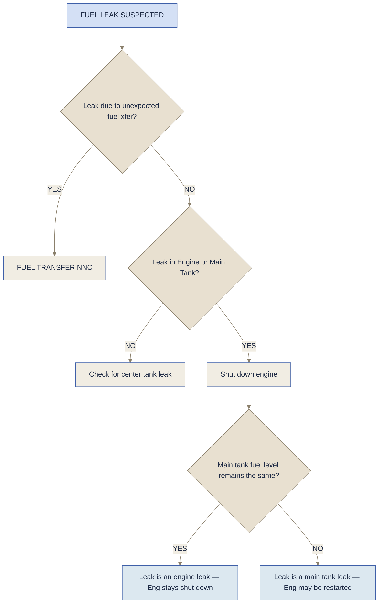

# Fuel Non-Normals

## Fuel Leak

> [!info]- Fuel Leak Suspected — Indications
> - Visual observation of fuel spray
> - Total fuel quantity decreasing at abnormal rate
> - An engine has excessive fuel flow
> - FUEL DISAGREE message
> - FUEL IMBALANCE message
> - FUEL QTY LOW message
> - INSUFFICIENT FUEL message

