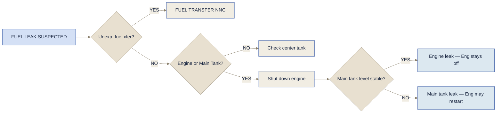

# Fuel Non-Normals

## Fuel Leak

> [!info]- Fuel Leak Suspected — Indications
> - Visual observation of fuel spray
> - Total fuel quantity decreasing at abnormal rate
> - An engine has excessive fuel flow
> - FUEL DISAGREE message
> - FUEL IMBALANCE message
> - FUEL QTY LOW message
> - INSUFFICIENT FUEL message

---

## Fuel Jettison

> [!caution] Fuel Jettison must be considered if…
> - **Stopping distance or G/A performance** is a concern
> - **Autoland** is required
>
> → Evaluate same or higher degree of safety
> → s. auch [[Non Normals/Abnormal Emergency Procedures|Overweight Landing]]

> [!info]- Requirements
> **OM-A 8.3.15.1**
> - In close coordination with ATC
> - \> 6000 ft AGL
> - Not in holding pattern
> - Clear of cities and towns
> - Away from thunderstorms
> - A flight report must be filed
>
> **FCTM B787:** If adequate time is available — ensure adequate weather minimums
>
> **OM-B 1-20-12-1:** Do not jettison fuel at Flaps 30

> [!info]- System Notes
> - Inhibited on GND
> - Jettison rate: Main tanks **500 kg/min** · Center tank **1200 kg/min**
> - At least **3900 kg** of fuel per main tank must remain

### Unannunciated Checklist

<strong>FUEL JETTISON ARM switch</strong><strong>ARMED</strong>

Do not jettison fuel at flap settings listed on the FUEL JETTISON control panel placard

<strong>FUEL TO REMAIN selector</strong><strong>PULL ON, set manually</strong>

Change FUEL TO REMAIN value if required before pulling selector

<strong>FUEL JETTISON NOZZLE valve switches (both)</strong><strong>ON</strong>

**When fuel jettison is complete:**

<strong>FUEL JETTISON NOZZLE valve switches (both)</strong><strong>OFF</strong>

<strong>FUEL TO REMAIN selector</strong><strong>OFF</strong>

<strong>FUEL JETTISON ARM switch</strong><strong>OFF</strong>

